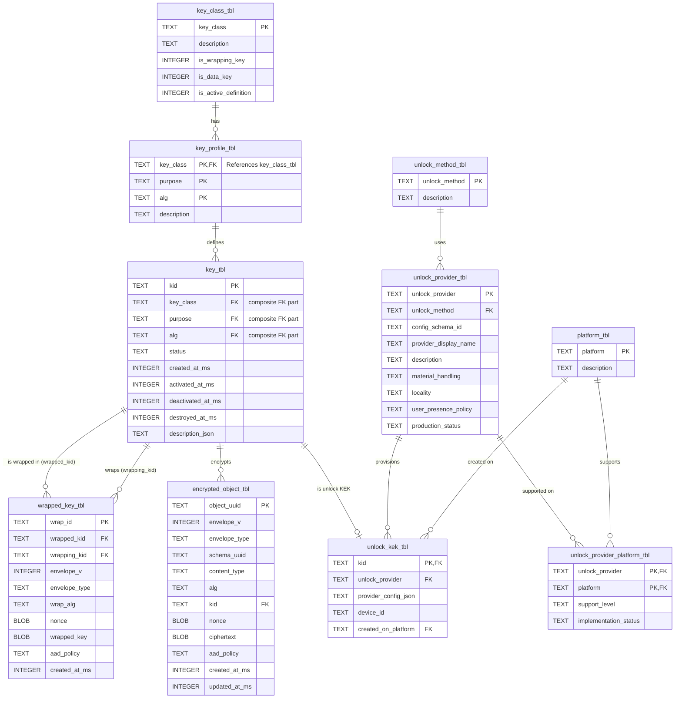

# Entity-Relationship (ER) Diagram

This document provides a graphical visualization of the SQLite schema defined in `schema.sql`.

```mermaid
erDiagram
    key_class_tbl ||--o{ key_profile_tbl : "has"
    key_profile_tbl ||--o{ key_tbl : "defines"
    key_tbl ||--o{ wrapped_key_tbl : "is wrapped in (wrapped_kid)"
    key_tbl ||--o{ wrapped_key_tbl : "wraps (wrapping_kid)"
    key_tbl ||--o{ encrypted_object_tbl : "encrypts"
    unlock_method_tbl ||--o{ unlock_provider_tbl : "uses"
    unlock_provider_tbl ||--o{ unlock_provider_platform_tbl : "supported on"
    platform_tbl ||--o{ unlock_provider_platform_tbl : "supports"
    key_tbl ||--o| unlock_kek_tbl : "is unlock KEK"
    unlock_provider_tbl ||--o{ unlock_kek_tbl : "provisions"
    platform_tbl ||--o{ unlock_kek_tbl : "created on"

    key_class_tbl {
        TEXT key_class PK
        TEXT description
        INTEGER is_wrapping_key
        INTEGER is_data_key
        INTEGER is_active_definition
    }

    key_profile_tbl {
        TEXT key_class PK, FK "References key_class_tbl"
        TEXT purpose PK
        TEXT alg PK
        TEXT description
    }

    key_tbl {
        TEXT kid PK
        TEXT key_class FK "composite FK part"
        TEXT purpose FK "composite FK part"
        TEXT alg FK "composite FK part"
        TEXT status
        INTEGER created_at_ms
        INTEGER activated_at_ms
        INTEGER deactivated_at_ms
        INTEGER destroyed_at_ms
        TEXT description_json
    }

    wrapped_key_tbl {
        TEXT wrap_id PK
        TEXT wrapped_kid FK
        TEXT wrapping_kid FK
        INTEGER envelope_v
        TEXT envelope_type
        TEXT wrap_alg
        BLOB nonce
        BLOB wrapped_key
        TEXT aad_policy
        INTEGER created_at_ms
    }

    encrypted_object_tbl {
        TEXT object_uuid PK
        INTEGER envelope_v
        TEXT envelope_type
        TEXT schema_uuid
        TEXT content_type
        TEXT alg
        TEXT kid FK
        BLOB nonce
        BLOB ciphertext
        TEXT aad_policy
        INTEGER created_at_ms
        INTEGER updated_at_ms
    }

    unlock_method_tbl {
        TEXT unlock_method PK
        TEXT description
    }

    unlock_provider_tbl {
        TEXT unlock_provider PK
        TEXT unlock_method FK
        TEXT config_schema_id
        TEXT provider_display_name
        TEXT description
        TEXT material_handling
        TEXT locality
        TEXT user_presence_policy
        TEXT production_status
    }

    platform_tbl {
        TEXT platform PK
        TEXT description
    }

    unlock_provider_platform_tbl {
        TEXT unlock_provider PK, FK
        TEXT platform PK, FK
        TEXT support_level
        TEXT implementation_status
    }

    unlock_kek_tbl {
        TEXT kid PK, FK
        TEXT unlock_provider FK
        TEXT provider_config_json
        TEXT device_id
        TEXT created_on_platform FK
    }
```
