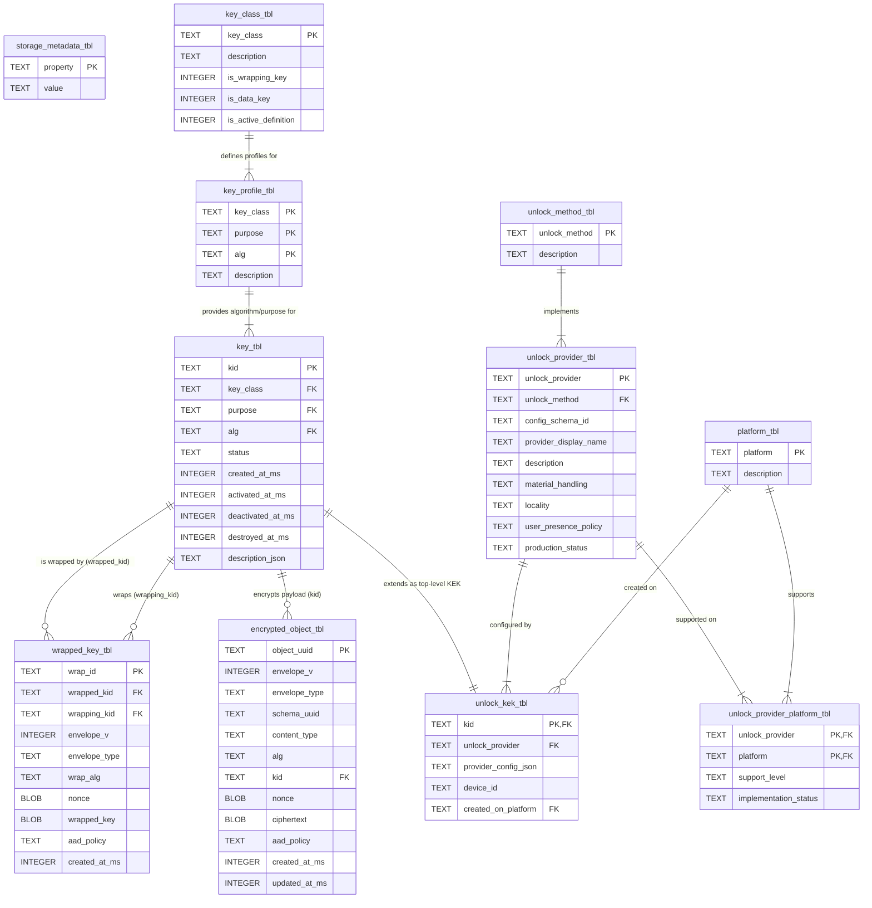
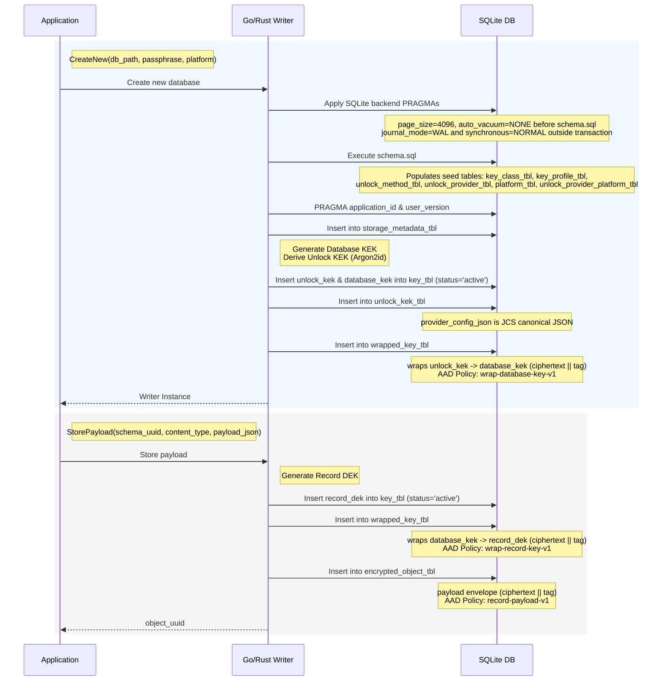

# SQLite Storage Format V1 Database Structure

This document provides a structural overview of the SQLite backend schema for Storage Format V1. It serves as an aid for understanding the database design. The canonical source of truth for the actual schema definition remains [`docs/backend/sqlite/schema.sql`](backend/sqlite/schema.sql). API surface parity across languages is tracked separately in [`docs/implementation-notes/api-parity-matrix.md`](implementation-notes/api-parity-matrix.md).

---

## Entity-Relationship Diagram

## Table Overview

The database tables are logically grouped into the following categories:

### Format Identity / Metadata

*   **`storage_metadata_tbl`**
    *   **Role**: Stores high-level database metadata as key-value pairs (e.g., `database_uuid`, `created_by_library`, `created_by_version`).
    *   **Primary Key**: `property`
    *   **Important Columns**: `property`, `value`

### Platform and Unlock Provider Metadata

*   **`unlock_method_tbl`**
    *   **Role**: Defines abstract unlock methods (e.g., `passphrase_kdf`, `os_secret_store`).
    *   **Primary Key**: `unlock_method`
*   **`unlock_provider_tbl`**
    *   **Role**: Defines specific provider implementations (e.g., `passphrase_argon2id`) for the unlock methods.
    *   **Primary Key**: `unlock_provider`
    *   **Foreign Key**: `unlock_method` references `unlock_method_tbl`
*   **`platform_tbl`**
    *   **Role**: Enumerates known operating system or runtime environments (e.g., `windows`, `macos`, `linux`, `web`).
    *   **Primary Key**: `platform`
*   **`unlock_provider_platform_tbl`**
    *   **Role**: Maps which unlock providers are supported on which platforms.
    *   **Primary Key**: (`unlock_provider`, `platform`)
    *   **Foreign Keys**: `unlock_provider`, `platform`

### Key Hierarchy and Wrapped Keys

*   **`key_class_tbl`**
    *   **Role**: Defines fundamental key classes (e.g., `unlock_kek`, `database_kek`, `record_dek`) and whether they are wrapping keys or data keys.
    *   **Primary Key**: `key_class`
*   **`key_profile_tbl`**
    *   **Role**: Associates a `key_class` with a specific `purpose` and `alg` (e.g., `unlock_kek` + `wrap_database_keys` + `A256GCM`).
    *   **Primary Key**: (`key_class`, `purpose`, `alg`)
    *   **Foreign Key**: `key_class`
*   **`key_tbl`**
    *   **Role**: The central registry of all cryptographic keys in the database.
    *   **Primary Key**: `kid`
    *   **Important Columns**: `status` (`active`, `decrypt_only`, `disabled`, `destroyed`)
    *   **Foreign Key**: (`key_class`, `purpose`, `alg`) references `key_profile_tbl`
*   **`unlock_kek_tbl`**
    *   **Role**: Extended metadata for Top-Level Unlock Key-Encryption Keys.
    *   **Primary Key**: `kid`
    *   **Important Columns**: `provider_config_json` (stores KDF parameters like Argon2id settings)
    *   **Foreign Keys**: `kid` references `key_tbl`, `unlock_provider`, `created_on_platform`
*   **`wrapped_key_tbl`**
    *   **Role**: Stores the ciphertext of a key (`wrapped_kid`) that has been encrypted by another key (`wrapping_kid`).
    *   **Primary Key**: `wrap_id`
    *   **Important Columns**: `envelope_v`, `envelope_type`, `wrap_alg`, `nonce`, `wrapped_key`, `aad_policy`
    *   **Foreign Keys**: `wrapped_kid`, `wrapping_kid` reference `key_tbl(kid)`

### Encrypted Objects / Payload Storage

*   **`encrypted_object_tbl`**
    *   **Role**: Stores the actual encrypted business data (JSON payloads) for records.
    *   **Primary Key**: `object_uuid`
    *   **Important Columns**: `schema_uuid`, `content_type`, `alg`, `nonce`, `ciphertext`, `aad_policy`
    *   **Foreign Key**: `kid` references `key_tbl` (the `record_dek` used to encrypt it)

## Key Hierarchy Explanation

The database utilizes an envelope encryption hierarchy to protect data while allowing password changes or multiple unlock methods without re-encrypting the bulk payloads.

1.  **Passphrase / Unlock Method**: The user provides a passphrase or authentication mechanism.
2.  **`unlock_kek_tbl.provider_config_json`**: For a passphrase, Argon2id parameters (salt, memory, iterations) are retrieved from this column to derive the **Unlock KEK** (`unlock_kek`) in memory.
3.  **`wrapped_key_tbl` (Database KEK Wrap)**: The `unlock_kek` is used to decrypt the Database KEK (`database_kek`) stored in `wrapped_key_tbl`. The `wrapping_kid` is the `unlock_kek`'s ID, and the `wrapped_kid` is the `database_kek`'s ID.
4.  **`wrapped_key_tbl` (Record DEK Wrap)**: The unwrapped `database_kek` is then used to decrypt the Record Data-Encryption Key (`record_dek`). Here, `wrapping_kid` is the `database_kek`'s ID, and `wrapped_kid` is the `record_dek`'s ID.
5.  **`encrypted_object_tbl`**: Finally, the unwrapped `record_dek` (`kid`) is used to decrypt the `ciphertext` payload of the requested object.

## Database Initialization and Writer Population Flow

When a new Storage Format V1 database is initialized by a writer (such as the Go or Rust scaffolds), the following sequence occurs to establish the cryptographic hierarchy and initial metadata:

1.  **SQLite PRAGMA Profile Setup**: The writer applies SQLite backend PRAGMAs before first schema/data writes. In current scaffold defaults, `page_size=4096` and `auto_vacuum=NONE` are applied before schema creation, while `journal_mode=WAL` and `synchronous=NORMAL` are set outside explicit transactions.
2.  **Schema Bootstrap**: The writer executes the canonical `docs/backend/sqlite/schema.sql`. This populates the database with **seed data** for static lookup tables (`key_class_tbl`, `key_profile_tbl`, `unlock_method_tbl`, `unlock_provider_tbl`, `platform_tbl`, `unlock_provider_platform_tbl`).
3.  **Platform Validation**: The writer validates the caller-provided platform string against the populated `platform_tbl`.
4.  **Root Key Generation**: The writer generates a new Database KEK (`database_kek`) and derives an Unlock KEK (`unlock_kek`) from the user's passphrase (e.g., via Argon2id).
5.  **Metadata Insertion**: A new UUID is generated for the database, and the writer populates `storage_metadata_tbl` with format versions, library identifiers (e.g., `"vault-go"`, `"vault-rust"`), timestamps, and feature flags.
6.  **Key and Wrap Insertion**:
    - The `database_kek` and `unlock_kek` are inserted into `key_tbl` with a status of `active`.
    - The `unlock_kek` configuration (like Argon2id salt and parameters) is canonicalized into **JCS canonical JSON** and stored in `unlock_kek_tbl.provider_config_json`.
    - The `database_kek` is encrypted with the `unlock_kek`. The resulting output is stored as `ciphertext || tag` in `wrapped_key_tbl.wrapped_key`, utilizing the `wrap-database-key-v1` AAD policy.
7.  **Payload Insertion (`StorePayload`)**:
    - A new Record DEK (`record_dek`) is generated and inserted into `key_tbl`.
    - The `record_dek` is wrapped by the `database_kek` and stored in `wrapped_key_tbl` (using the `wrap-record-key-v1` AAD policy).
    - The user's JSON payload is encrypted using the `record_dek`. The output is stored as `ciphertext || tag` in `encrypted_object_tbl.ciphertext` using the `record-payload-v1` AAD policy.

**Note on Lifecycle Fields**: The minimal writer scaffolds intentionally leave complex key lifecycle fields (`activated_at_ms`, `deactivated_at_ms`, `destroyed_at_ms`, `description_json`, `device_id`) absent (NULL). Update/delete are implemented for payload rows, but key lifecycle operations (key rotation, decrypt-only migrations, key destruction, rewrap) remain out of scope.

## SQLite Backend PRAGMA Profile (Writer)

This section documents **writer defaults and connection-setting guidance** for SQLite backends. It does not replace the normative requirements in [`docs/spec/storage-format-sqlite.md`](spec/storage-format-sqlite.md).

### Normative requirement reference

For normative per-connection PRAGMA requirements (including `PRAGMA foreign_keys=ON`), follow [SQLite Storage Profile spec §4 Required PRAGMAs](spec/storage-format-sqlite.md#4-required-pragmas).

### Writer defaults during database creation

* `PRAGMA page_size=4096`
* `PRAGMA auto_vacuum=NONE`
* `PRAGMA synchronous=NORMAL` (Operational recommendation)
* `PRAGMA journal_mode=WAL` (Operational recommendation)

### Apply Timing Guidance (Writer Defaults)

* If using these writer defaults, apply `page_size` and `auto_vacuum` **before schema creation** (before executing `docs/backend/sqlite/schema.sql`).
* `journal_mode` and `synchronous` are connection-level durability/journaling settings and should be configured **outside an active transaction** during initialization.
* Writers should set these PRAGMAs at initialization time before first write operations so subsequent schema/data writes follow the intended profile.

## Metadata and Compatibility

*   **`PRAGMA application_id` and `PRAGMA user_version`**: SQLite-level magic numbers and schema versioning markers. These are the first checks performed by a reader to identify the file format before executing any queries.
*   **`storage_metadata_tbl`**: Stores application-level metadata. Crucially, it contains the `database_uuid`. Implementations will also store `created_by_library` and `created_by_version` here for diagnostic provenance, though implementations must not reject unfamiliar provenance strings.
*   **Feature Flags / Extensibility**: The `envelope_v` and `envelope_type` columns in `wrapped_key_tbl` and `encrypted_object_tbl` act as inline versioning and typing markers for the cryptographic envelopes, allowing the format to evolve safely.

## AAD and Envelope Explanation

Storage Format V1 uses Authenticated Encryption with Associated Data (AEAD), specifically AES-256-GCM. The `aad_policy` column dictates how the Additional Authenticated Data (AAD) is constructed before decryption is attempted.

*   **Database Key-Wrap Envelope (`wrapped_key_tbl`)**: The `aad_policy` is `wrap-database-key-v1`. It binds the wrap context specifically for the database-level key.
*   **Record Key-Wrap Envelope (`wrapped_key_tbl`)**: The `aad_policy` is `wrap-record-key-v1`. It binds the wrap context for individual record DEKs.
*   **Payload Envelope (`encrypted_object_tbl`)**: The `aad_policy` is `record-payload-v1`. The AAD is reconstructed using `object_uuid`, `schema_uuid`, `content_type`, `kid`, and `alg`. This cryptographically binds the encrypted payload to its surrounding metadata schema, preventing tampering or record-swapping attacks.

*Note: The Go and Rust minimal writers populate these specific AAD policies during encryption, and read-only readers implement these policies strictly to validate integrity before returning plaintext.*

## Update/Delete Operation Behavior (Current Scaffold Scope)

Current Go/Rust scaffold implementations expose `UpdatePayload` / `DeletePayload` (`update_payload` / `delete_payload`) with the following behavior (still within current scaffold scope, not full key lifecycle semantics):

* **Update operation**
  * `object_uuid` is preserved (in-place logical record update).
  * The existing `record_dek` (`kid`) is reused for that object.
  * A **new nonce** and **new ciphertext** are generated for every update operation.
  * `updated_at_ms` is refreshed while `created_at_ms` remains unchanged.
* **Delete operation**
  * Delete removes only the row in `encrypted_object_tbl` (logical hard delete of the payload row).
  * Delete does **not** perform cleanup of `key_tbl`, `wrapped_key_tbl`, or `unlock_kek_tbl` in current scaffold scope.
  * Delete is a logical removal and is **not** a secure-erase guarantee at storage-medium level.

Key lifecycle operations (rotation, decrypt-only migrations, destruction semantics, rewrap, orphan key cleanup policy) remain future work.

## Related Source Documents

*   [Schema Definition: `docs/backend/sqlite/schema.sql`](backend/sqlite/schema.sql)
*   [Core Storage Format Specification](spec/storage-format.md)
*   [SQLite Storage Profile](spec/storage-format-sqlite.md)
*   [Envelope & Cryptography Specification](spec/envelope-format.md)
*   [Portability & Read-Only Reader Implementation](spec/storage-format-v1-portability.md)
*   [Implementation Gaps & Known Issues](implementation-notes/implementation-gaps.md)
