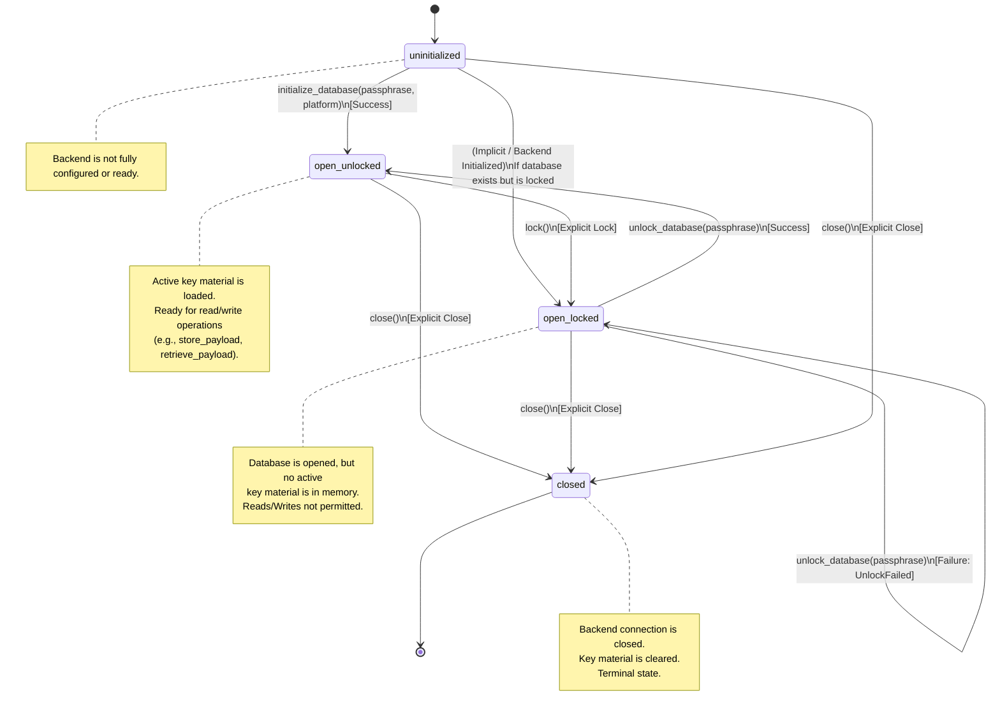

# Lifecycle States Diagram

This document illustrates the state transitions and lifecycle of the Encrypted Database, as defined in the [API Contract](api-contract.md).

## State Diagram

The following state diagram maps out the core lifecycle states (`uninitialized`, `open_locked`, `open_unlocked`, `closed`) and the API operations that drive the transitions between them. It also includes failure scenarios, such as when unlocking fails.

